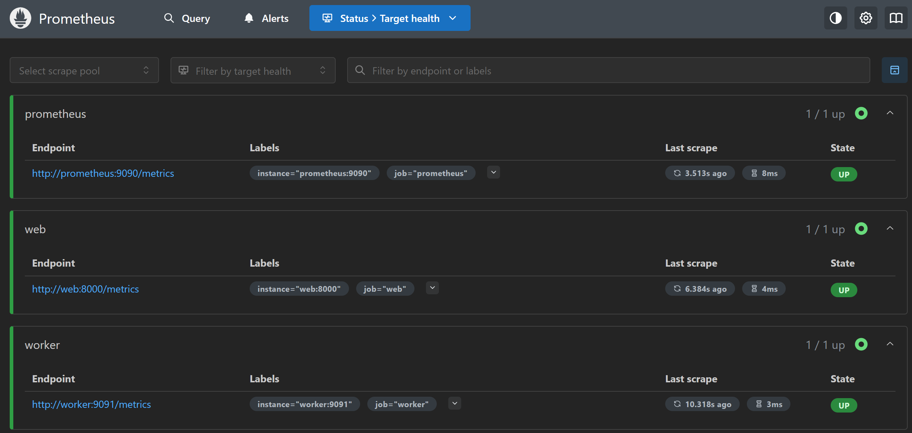
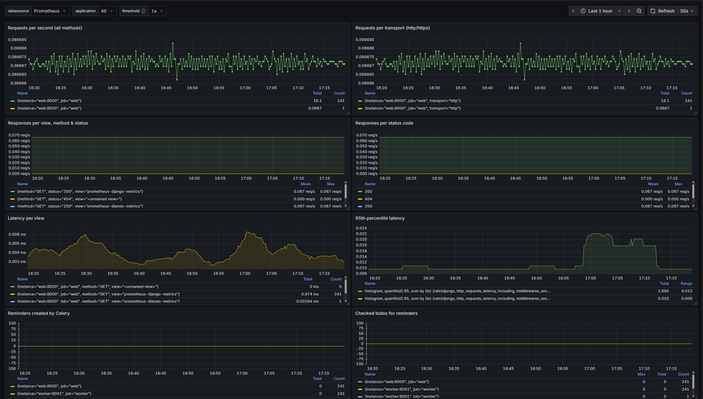

<h1 align="center">Task Track API using Django REST Framework </h1>

<div align="justify">
Designed and implemented a fully containerized, secure, and scalable task management REST API using Django REST Framework. Leveraged ModelViewSet, nested serializers, and DjangoFilterBackend to create a clean, DRY endpoint architecture. The API supports authenticated CRUD operations on tasks and their schedules, integrates custom permissions and request throttling for security and performance, and features interactive API documentation via Swagger UI and ReDoc UI. Implemented a robust CI/CD pipeline using GitHub Actions to automate testing, Docker image builds, and deployment to Docker Hub, ensuring continuous integration and zero-setup delivery. Deployed and distributed the app through Docker Hub, enabling anyone to run the project with a single command and no local setup overhead.
</div>

---

## Table of Contents

- [Features](#features)
- [Tech Stack](#tech-stack)
- [Setup Instructions](#setup-instructions)
- [Project Structure](#project-structure)
- [API Endpoints](#api-endpoints)
- [API Testing with Postman](#api-testing-with-postman)
- [API Documentation (Swagger UI)](#api-documentation-swagger-ui)
- [Monitoring & Observability](#monitoring--observability)
- [Run This Project via Docker](#run-this-project-via-docker)
- [Working On](#working-on)
- [Future Work](#future-work)
- [Maintainer](#maintainer)

---

## Features

- Implemented full URL level versioned CRUD operations for Todo and nested TimingTodo endpoints
- Token and Session Authentication with custom permissions for controlled API access
- Throttling configured for both anonymous and authenticated users to prevent abuse
- Custom pagination using LimitOffsetPagination for flexible data access
- Integrated filtering with DjangoFilterBackend, SearchFilter, and OrderingFilter
- Nested endpoints for managing TimingTodo objects under specific Todo resources
- Secure, versioned Swagger UI and ReDoc for interactive API docs and developer testing with authentication.
- Containerized with Docker and published to Docker Hub for seamless deployment
- CI/CD pipeline built using GitHub Actions for automated build, test, and Docker push
- One-command setup with docker-compose to run the full app without local configuration
- Implemented and integrated Prometheus and Grafana for application and task monitoring
- Built Grafana dashboard for Django metrics, Celery tasks, and performance

---

## Tech Stack
This project leverages the following technologies:

| **Layer**         | **Technology**                                                  | **Description**                                  |
| ----------------- | --------------------------------------------------------------- | ------------------------------------------------ |
| Language          | [Python 3.10+](https://www.python.org/)                         | Core programming language                        |
| Web Framework     | [Django 5.2](https://www.djangoproject.com/)                    | High-level web framework for rapid development   |
| API Toolkit       | [Django REST Framework](https://www.django-rest-framework.org/) | Flexible toolkit to build Web APIs               |
| Filtering         | [django-filter](https://django-filter.readthedocs.io/)          | Add filtering to DRF views                       |
| Docs Generator    | [drf-yasg](https://drf-yasg.readthedocs.io/)                    | Auto-generate Swagger/OpenAPI docs               |
| Dev Utilities     | [django-extensions](https://django-extensions.readthedocs.io/)  | Useful dev commands like `shell_plus`, etc.      |
| Env Config        | [python-dotenv](https://pypi.org/project/python-dotenv/)        | Loads environment variables from `.env` files    |
| Task Queue        | [Celery](https://docs.celeryq.dev/)                             | Distributed task queue for background jobs       |
| Message Broker    | [Redis](https://redis.io/)                                      | In-memory data store used as Celery broker       |
| Monitoring (Data) | [Prometheus](https://prometheus.io/)                            | Metrics collection and alerting                  |
| Monitoring (UI)   | [Grafana](https://grafana.com/)                                 | Dashboard visualization for metrics              |
| Containerization  | [Docker](https://www.docker.com/)                               | Containerize the app for any environment         |
| Image Hosting     | [Docker Hub](https://hub.docker.com/)                           | Store and distribute Docker images               |
| Database          | [SQLite](https://www.sqlite.org/index.html) (default)           | Lightweight, file-based database for dev/testing |
| Orchestration     | [Docker Compose](https://docs.docker.com/compose/) *(optional)* | Manage multi-container setups (DB, Redis, etc.)  |
| CI/CD Automation  | [GitHub Actions](https://github.com/features/actions)           | Automate tests, builds, and Docker deployments   |

---

## Setup Instructions

Follow these steps to set up the project on your local machine:

#### 1. Clone the Repository

```bash
git clone https://github.com/your-username/your-repo-name.git
cd your-repo-name
```
#### 2. Create and Activate a Virtual Environment

<details>
<summary><strong>macOS / Linux</strong></summary>
    
```bash
python -m venv venv
source venv/bin/activate
```
</details> 

<details> 
<summary><strong>Windows</strong></summary>
    
```bash
python -m venv venv
venv\Scripts\activate
```
</details>

#### 3. Install Project Dependencies
```bash
pip install -r requirements.txt
```
<details>
<summary><strong>Or manually</strong></summary>
    
```bash
pip install django djangorestframework
```
</details>  

#### 4. Apply Database Migrations
```bash
python manage.py migrate
```

#### 5. Create a superuser:

```bash
python manage.py createsuperuser
```

#### 6. Start the Development Server
```bash
python manage.py runserver
```
Once the server is running, visit http://localhost:8000 to access the API.

#### 7. Obtain Auth Token (after logging in):
```http
POST /token/
```

#### 🔑 Authentication Example (Token-Based)
Include the token in the Authorization header:
```http
Authorization: Token your_token_here
```
---

## Project Structure

```text
drf_learning/
├── manage.py               # Django management script
├── env                     # Python virtual environments
├── requirements.txt        # Python dependencies
├── .dockerignore           # Lists files/directories Docker should ignore during image build
├── docker-compose.yml      # Defines multi-container Docker applications
├── Dockerfile              # Contains instructions to build a Docker image
├── Makefile                # (Optional) Defines shell commands for development workflow automation
├── README.md               # Project overview, setup instructions, usage, etc.
├── drfproject/             # Django project configuration
│   ├── __init__.py
│   ├── settings.py         # Main settings file
│   ├── urls.py             # Root URL configuration
│   └── wsgi.py             # WSGI application
└── home/                   # Core application (e.g., Todo API)
    ├── __init__.py
    ├── models.py           # Database models
    ├── serializers.py      # DRF serializers for data validation
    ├── views.py            # API views (ModelViewSet)
    ├── permissions.py      # Custom permission classes for the Task Management API
    ├── urls.py             # App-level routing
    └── admin.py            # Admin site configuration
```

---

## API Endpoints

#### 📌 Todo Endpoints

| Method | Endpoint        | Description              |
| ------ | --------------- | ------------------------ |
| GET    | `/todos/`       | List all todos           |
| POST   | `/todos/`       | Create a new todo        |
| GET    | `/todos/{uid}/` | Retrieve a specific todo |
| PATCH  | `/todos/{uid}/` | Partially update a todo  |
| DELETE | `/todos/{uid}/` | Delete a todo            |


#### 🕒 Nested TimingTodo under Todo

| Method | Endpoint                      | Description                        |
| ------ | ----------------------------- | ---------------------------------- |
| GET    | `/todos/{uid}/timings/`       | List timings of a specific todo    |
| POST   | `/todos/{uid}/timings/`       | Add a timing to a specific todo    |
| GET    | `/todos/{uid}/timings/{tid}/` | Retrieve specific timing           |
| PATCH  | `/todos/{uid}/timings/{tid}/` | Partially update a specific timing |
| DELETE | `/todos/{uid}/timings/{tid}/` | Delete a specific timing           |

#### 🔄 All TimingTodo Endpoints

| Method | Endpoint    | Description               |
| ------ | ----------- | ------------------------- |
| GET    | `/timings/` | List all timing entries   |
| POST   | `/timings/` | Create a new timing entry |

---

## API Testing with Postman
POST /todos/

🔹 Headers:

```http
Content-Type: application/json
Authorization: Token your_token_here
```

🔹 Body:

```json
{
  "todo_title": "Learn DRF",
  "todo_description": "Practice ViewSets and Throttling",
  "is_done": false
}

```
🔹 Response:

```json
{
  "status": true,
  "message": "Todo created successfully",
  "data": {
    "uid": "uuid-value",
    "todo_title": "Learn DRF",
    "todo_description": "Practice ViewSets and Throttling",
    "is_done": false,
    ...
  }
}
```
---

## API Documentation (Swagger UI)
This **Task Track (Todo) API** project is integrated with **Swagger UI** for easy exploration and testing of available endpoints.

📄 **Access the interactive documentation:**  
[http://localhost:8000/swagger/](http://localhost:8000/swagger/) &nbsp;_(only available in development mode)_

✅ Anyone can view and interact with the API directly through the Swagger interface when the server is running locally.

---

## Monitoring & Observability
To ensure reliability and performance, this Task Track application includes a complete monitoring and visualization setup powered by Prometheus and Grafana.
Below are example screenshots from the monitoring setup for the Task Track app:

### Prometheus

- Collects real-time metrics from the Django application and Celery workers.
- Tracks key indicators such as request rates, response codes, latency, and scheduled reminder executions.
- **Prometheus Targets**
    
  *Figure 1: Prometheus successfully scraping metrics from Django app, Celery worker, and Prometheus server.*


### Grafana Dashboards

- Visualizes metrics through intuitive dashboards with graphs, tables, and gauges.
- Offers deep insights into:
  - HTTP requests and responses (by method, status, and view)
  - Request latency (average and percentile distributions)
  - Celery task execution, success/failure rates, and reminder scheduling
- **Grafana Overview**
    
  *Figure 2: High-level overview of Task Track app performance metrics.*


---

## Run This Project via Docker

#### 🚀 You can pull and run this API directly from Docker Hub:

```bash
# Pull the image
docker pull proma93/drf_learning-web:latest

# Run the container
docker run -p 8000:8000 proma93/drf_learning-web:latest
```
➡️ Open [http://localhost:8000/swagger/](http://localhost:8000/swagger/) in your browser.

#### 📦 Persistent Volume Setup (Optional)
```bash
# Create a volume
docker volume create drf_data

# Run with volume mount for persistent SQLite DB
docker run -v drf_data:/app/data -p 8000:8000 proma93/drf_learning-web:latest
```
🌐 Visit: [http://localhost:8000](http://localhost:8000) in your browser.

#### 📦 Docker Hub
You can find the published image here:
👉 [proma93/drf_learning-web](https://hub.docker.com/r/proma93/drf_learning-web)

---
## Working On

- Implementing Celery with Redis to manage background tasks, enabling features like periodic reminders for task creation and due dates.
- Integrating Flower for real-time Celery task monitoring and management.
  
## Future Work

- **Role-Based Access Control (RBAC)**: Add user roles (admin, manager, user) with scoped permissions for finer-grained access control.
- **Improve Test Coverage**: Expand unit and integration tests using `pytest`, aiming for high coverage and reliability in edge cases.
- **Production-Ready Deployment**: Set up deployment using Gunicorn + Nginx with Docker, along with HTTPS (Let's Encrypt) and environment hardening.
- **Monitoring and Logging**: Integrate Sentry for error tracking and Prometheus/Grafana for metrics and observability.
- **Use PostgreSQL**: Switch to PostgreSQL for better performance, reliability, and advanced DB features over SQLite.

---

## Maintainer
 
🐳 [Docker Hub](https://hub.docker.com/r/proma93/drf_learning-web)  
💻 [GitHub](https://github.com/Proma93)


